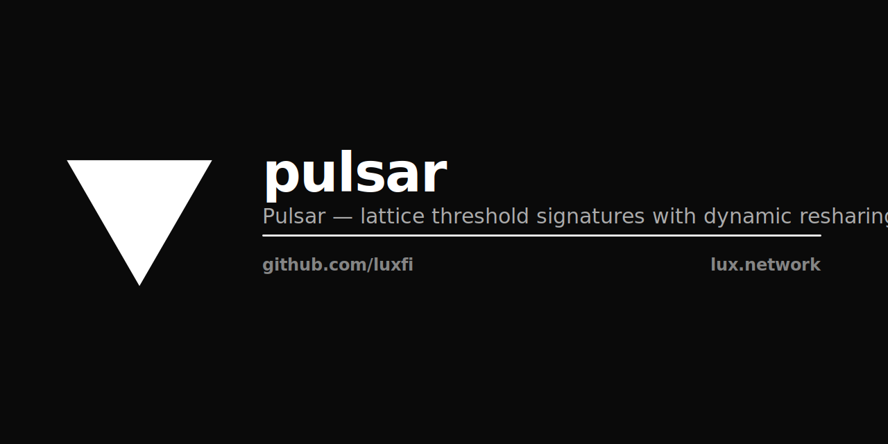

<p align="center"></p>

# Pulsar — NIST MPTC submission package

> **Threshold ML-DSA** — a two-round lattice kernel (TALUS adds one-round
> online signing) for threshold signing and DKG whose generated signatures are
> verifiable by **unmodified FIPS 204 ML-DSA verification**. Targeting NIST
> MPTC Class N1 (signing) + N4 (ML keygen / DKG).

This repository is the **active NIST MPTC submission package** for Pulsar
and the canonical home for the submission artifacts (spec, KAT vectors,
reference implementation, interop harness, ct analysis, scripts). The
submission tarball for NIST is cut from a tag on `main` at deadline —
the repository itself stays active so reviewer feedback and post-
submission patches land here, not in a fork.

The production Go library has split into its own stable module identity
(`github.com/luxfi/pulsar` / `github.com/luxfi/corona`); this repository
keeps the original `github.com/luxfi/pulsar` module path because that
is the identifier NIST receives and reviews against.

## Library identities (post-2026 split)

`Pulsar` is the Module-LWE threshold ML-DSA construction. The two-round
lattice kernel operates on ML-DSA-65's polynomial-vector-over-`R_q` algebra so
the per-party-aggregated signature is bit-identical to a single-party FIPS 204
signature on the same message + public key; TALUS (v1.2.0) adds one-round
online signing on top of that kernel.

> **Aggregator-honesty caveat (v0.2 vs v0.3).** Bit-identity to a
> single-party FIPS 204 signature is achieved without master-secret
> reconstruction only by the **v0.3 algebraic** aggregator
> (`ref/go/pkg/pulsar/threshold_v03.go::AlgebraicAggregate`). The
> **v0.2 transitional** aggregator
> (`ref/go/pkg/pulsar/threshold_v02.go::TransitionalAggregate`)
> reconstructs the master ML-DSA secret in aggregator memory and
> calls `mldsaSign(setup.SkBytes, …)` (`threshold_v02.go:1170`) —
> output byte-equality holds but TCB at sign time includes the
> aggregator. The N1 submission targets the v0.3 aggregator;
> v0.2 is documented for protocol-evolution traceability.
> PULSAR-V03-1 closure record (the v0.3 byte-equality fix in
> v1.0.20) lives in `BLOCKERS.md` under `## Closed`.

| Repository | Module path | Role |
|---|---|---|
| **luxfi/pulsar** (this repo) | `github.com/luxfi/pulsar` | Active NIST MPTC submission package |
| [luxfi/pulsar](https://github.com/luxfi/pulsar) | `github.com/luxfi/pulsar` | Production Module-LWE Go library |
| [luxfi/corona](https://github.com/luxfi/corona) | `github.com/luxfi/corona` | Production Ring-LWE Go library (sibling kernel) |

The module path inside this submission package remains
`github.com/luxfi/pulsar` because that is the identifier NIST receives
and reviews against the submitted KAT vectors and spec. Downstream
consumers who want the live production library should pin
`github.com/luxfi/pulsar@v1.2.x` (Module-LWE) or
`github.com/luxfi/corona@v0.2.x` (Ring-LWE) instead.

> **Status (v1.2.0).** Algorithm-level reference implementation. The TALUS
> threshold ML-DSA path (dealerless nonce DKG + CEF + CSCP) is BUILT and
> PULSAR-V13-W-LEAK is CLOSED (semi-honest, simulation-proven); the two open
> residuals are the CSCP malicious-secure layer + a networked MPC deployment
> (Residual A) and dealerless-key impossibility ⇒ trusted-dealer keygen with
> Corona carrying permissionless (Residual B) — see `BLOCKERS.md`. NIST-profile
> vectors use SHAKE / cSHAKE / KMAC (FIPS 202 + SP 800-185); the MPTC
> submission excludes BLAKE3. Deployed-binary tracks (Rust crate, C library,
> WASM, no_std) carry their own constant-time audit + KAT cross-validation
> before claiming production posture.

## TALUS — one-round online threshold signing (v1.2.0)

TALUS is the threshold ML-DSA scheme built on the two-round lattice kernel; it
adds **one-round online signing** via three pillars — a dealerless Shamir
**nonce DKG**, the **CEF** (Carry Elimination Framework, distributed `w1`), and
**CSCP** (the CarryCompare secure-comparison protocol). FROST-style
additive-nonce threshold ML-DSA is impossible (HighBits/r0/carry rounding is
non-linear; no homomorphic nonce commitment exists); TALUS routes around it
with the BCC (Boundary Clearance Condition) + CEF + dealerless nonce DKG.

- **Two profiles.** **Pulsar-TEE** — a TEE-backed `w1` source. **Pulsar-MPC** —
  TEE-free, honest-majority (N ≥ 2T−1); no node forms the joint nonce `ȳ` or
  the commitment `w`. The emitted signature is byte-identical across profiles.
- **W-LEAK closed (semi-honest, simulation-proven).** The REAL CSCP
  secure-comparison circuit computes `w1 = HighBits(Σ g_i mod q)` so that NO
  node forms `w0` or the full commitment `w` even transiently — proven leak-free
  by transcript / structural / reflection tests in an in-process N-party
  SIMULATION (not yet a networked deployment; the malicious-secure layer is
  unbuilt — see `BLOCKERS.md` Residual A).
- **Stock FIPS-204 verify.** A TALUS signature verifies byte-equal under the
  UNMODIFIED `cloudflare/circl` `mldsa65.Verify` / `mldsa87.Verify`; `FindHint`
  + a mandatory release-gate verify bound any malicious CSCP deviation to
  liveness-only (abort/retry) — never forge or leak.
- **KEYGEN is trusted-dealer.** Dealerless byte-FIPS-204 KEY DKG is *proven
  unreachable* (a sum-of-contributions secret leaves S_η = {‖p‖∞ ≤ η}); the
  **permissionless-public guarantee is carried by Corona** (natively dealerless)
  in the Quasar AND-mode dual-PQ cert (Residual B).

## High-assurance headline

All local EasyCrypt theorem bodies are admit-free, per-push gates are
green, threshold Jasmin CT is blocking, fuzz / KAT / interop / dudect
gates are wired at documented budgets, and the extracted N1 theorem has
no section-local module-contract axioms. The remaining
implementation-refinement assumptions have been progressively
decomposed into strictly narrower axioms with a committed proof
roadmap; the Lean↔EC algebraic bridge is named, cited, and CI-guarded.

The dependency graph is acyclic and each EC file owns one concern:

```text
Memory             → pure byte-memory model
Signature_Codec    → FIPS signature packing
Combine_Layout     → combine ABI only
Sign_Layout        → sign ABI only
Combine_Refinement → combine byte-walk only
Sign_Refinement    → sign byte-walk + ghost contract only
Combine_Wrapper    → combine wrapper bridge only
Sign_Wrapper       → sign wrapper bridge only
Extracted          → final composition theorem only
```

Hard boundary — **22 named axioms total**, each with file:line in EC and Lean
(verified against `proofs/easycrypt/*.ec` `axiom`/`declare axiom` declarations
as of HEAD):

- **17 narrow implementation-refinement axioms** in the refinement files:
    - 14 byte-walk axioms (4 stage-extraction + 4 w-decomposition + 2 w_low
      + 4 ExternalMu codec-layout), authoritative from
      `Pulsar_N1_{Combine,Sign}_Refinement.ec`
    - 1 signature-codec round-trip in `Pulsar_N1.ec`
      (`pack_unpack_n1_signature_roundtrip`)
    - 2 honest-execution no-reject post-conditions
      (`{combine,sign}_no_reject_on_accepted_honest_layout`),
      gated on the protocol-level `accept_signing_attempt` predicate
- **5 Lean-bridged algebraic axioms**, cited inline and CI-guarded
  (`proofs/lean-easycrypt-bridge.md`: `lagrange_inverse_eval`,
  `reconstruct_linear`, `shamir_correct`, `add_share_zeroR`,
  `threshold_partial_response_identity`)
- 0 admits in any `.ec` file
- 0 section-local module-contract axioms in the extracted N1 corollary

The 14 byte-walks split as: 4 stage-extraction
(`combine_body_{z_via_aggregation,partial_responses}_spec`,
`sign_body_{y,cs1}_spec`); 4 w-decomposition
(`{combine,sign}_body_{matrix_a,mask_y}_spec`; `*_body_w_spec` derived);
2 w_low (`{combine,sign}_body_w_low_spec`; `*_body_h_spec` derived via
`make_hint_of_w`); 4 ExternalMu codec-layout (combine: 3 per-range
sub-axioms; sign: 1 collapsed `sign_layout_m_buffer_external_mu`).

See `proofs/easycrypt/README.md` for the per-file dashboard and
`proofs/lean-easycrypt-bridge.md` for the Lean↔EC correspondence.

`combine_body_partial_responses_spec` is the narrowest remaining per-party
byte-walk on the combine side over Round-2 messages; the v13 closure path
is a matrix_a/mask_y-style structural split, with the per-axiom roadmap
under `proofs/easycrypt/extraction/`.

## Why

NIST FIPS 204 (ML-DSA) is the only NIST-approved post-quantum digital
signature in 2026. Threshold variants of ML-DSA are not yet standardized —
NIST's [Multi-Party Threshold Cryptography](https://csrc.nist.gov/projects/threshold-cryptography)
project is collecting them now (IR 8214C, January 2026; first call package
deadline expected 2026-Nov-16).

Pulsar aims to enter that process with a credible, output-interchangeable
threshold ML-DSA candidate. The 2-round threshold protocol skeleton is
the same one Lux ships in production for Ring-LWE (see
[`luxfi/corona`](https://github.com/luxfi/corona)), retargeted to the
Module-LWE primitives ML-DSA itself uses; the resulting per-party-
aggregated signature (under the v0.3 algebraic aggregator) is
bit-identical to a single-party FIPS 204 ML-DSA signature on the same
message + public key.

The win, if Pulsar's Sign output is byte-equal to FIPS 204 Sign:
- Threshold-produced signatures verify under unmodified FIPS 204 verifiers.
- Existing FIPS-validated ML-DSA modules (BoringSSL FIPS, AWS-LC, OpenSSL
  3.0 PQ provider) consume Pulsar certs without code changes.
- The threshold layer can be Class-N-claimed at NIST without a parallel
  algorithm standardization track.

## Repository layout

```
pulsar/
├── BLOCKERS.md               finding registry (Open: Residual A — CSCP malicious-secure + networked MPC; Residual B — dealerless-key impossible ⇒ trusted-dealer keygen + Corona carries permissionless. Closed: PULSAR-V13-W-LEAK semi-honest v1.2.0; PULSAR-V03-1 v1.0.20 ExpandA fix)
├── SUBMISSION.md             NIST MPTC cover sheet (single source of truth for reviewer)
├── CHANGELOG.md              per-version proof artefact log (v4 → v13)
├── README.md                 this file
├── docs/                     reviewer-facing documentation set
│   ├── status.md             submission-readiness checkpoint (READY FOR SUBMISSION)
│   ├── proof-claims.md       narrow N1 byte-equality claim
│   ├── proof-axiom-inventory.md   per-axiom enumeration with closure plan
│   ├── tcb.md                EC / Jasmin / OCaml / Lean TCB
│   ├── fips-204-traceability.md   op / lemma → FIPS 204 § map
│   ├── cryptographer-sign-off.md  independent review (APPROVED WITH GATES, all closed)
│   ├── deployment.md         operator runbook + trust-model disclosure
│   ├── spec-overview.md      standalone spec companion to spec/pulsar.tex
│   ├── ietf-draft-skeleton.md     IETF / CFRG draft (draft-hanzo-pulsar-threshold-mldsa-00)
│   ├── evaluation.md         NIST IR 8214C §6 experimental-evaluation report
│   ├── patents.md            royalty-free patent grant text
│   ├── threat-model.md, design-decisions.md, family-architecture.md,
│   ├── nist-mptc-category.md, magnetar.md, x-wing-sig.md,
│   ├── suite.md, information-architecture.md, single-impl-plan.md,
│   ├── roadmap.md, sync-status.md, licensing-notes.md
├── spec/                     LaTeX technical specification (MPTC package)
│   ├── pulsar.tex            main spec (1633 lines)
│   ├── security-games.tex    EUF-CMA / TS-UF / robustness / adaptive corruption
│   ├── system-model.tex      network / setup / abort / preprocessing
│   ├── parameters.tex        concrete parameter sets, lattice-estimator inputs
│   ├── threat-model.tex, design-decisions.tex, family-architecture.tex,
│   ├── nist-mptc-category.tex, patent-notes.tex, blockers.tex
│   └── references.bib
├── ref/
│   ├── go/                   reference implementation (Go, no assembly)
│   │   ├── cmd/genkat/       KAT generator binary
│   │   └── pkg/pulsar/       single flat package: keygen, sign, DKG, reshare,
│   │                         threshold (v0.1 reveal-and-aggregate / v0.2 transitional /
│   │                         v0.3 algebraic), large-committee path, abort tape,
│   │                         KAT replay, fuzz
│   └── c/                    conformance implementation (post-encoding-freeze)
├── vectors/                  Known Answer Tests (KATs)
│   ├── {dkg,keygen,sign,threshold-sign,verify}.json   per-stage KATs
│   └── transcripts/          full-protocol KATs (n,t sweeps)
├── bench/                    reproducible benchmark harness + results/REPORT.md
├── test/                     fuzz / negative / interoperability tests (19/19 N1 PASS)
├── ct/dudect/                constant-time analysis harness + results/
├── estimator/                lattice-estimator parameter scripts
├── jasmin/                   high-assurance Jasmin sources (3/3 jasmin-ct blocking green)
│   ├── ml-dsa-65/            libjade single-party baseline (fetched on demand)
│   └── threshold/            Pulsar threshold layer (round1 + round2 + combine)
├── proofs/easycrypt/         13 EC files, 0/0 admits, 22 named axioms with file:line
│   ├── Pulsar_N1.ec                       Class N1 protocol spec + generic theorem
│   ├── Pulsar_N4.ec                       Class N4 reshare pk-preservation
│   ├── Pulsar_N1_Memory.ec                byte-memory model (0 axioms)
│   ├── Pulsar_N1_Signature_Codec.ec       FIPS 204 sig codec
│   ├── Pulsar_N1_{Combine,Sign}_Layout.ec   ABI byte layout
│   ├── Pulsar_N1_{Combine,Sign}_Refinement.ec   per-side refinement scaffold
│   ├── Pulsar_N1_{Combine,Sign}_Wrapper.ec  wrapper module + bridge lemma
│   ├── Pulsar_N1_Extracted.ec             extracted N1 byte-equality corollary
│   ├── lemmas/MLDSA65_Functional.ec       FIPS 204 functional ops
│   ├── lemmas/Pulsar_CT.ec                constant-time obligations
│   └── README.md                          trust-boundary dashboard + per-file concerns
├── proofs/lean-easycrypt-bridge.md        Lean↔EC algebraic-bridge correspondence
├── scripts/
│   ├── check-high-assurance.sh            per-push proof gate orchestrator
│   ├── test.sh                            per-push test gate orchestrator
│   ├── nightly.sh                         cron-scheduled real-budget gate
│   │                                       (1h fuzz/target + 10⁹-sample dudect/target)
│   ├── check-lean-bridge.sh               Lean↔EC bridge guard
│   ├── cut-submission.sh                  tarball cut tool
│   ├── checks/                            per-check scripts (independently runnable)
│   └── build.sh / bench.sh / sbom.sh / gen_vectors.sh / extract-jasmin-ec.sh
└── go.mod
```

## Quickstart

The repository is **live and self-validating**. A fresh clone runs the
full per-push submission gate end-to-end in under 60 seconds:

```bash
git clone https://github.com/luxfi/pulsar
cd pulsar
./scripts/build.sh                  # Go ref + spec PDF (MacTeX / TeX Live)
./scripts/test.sh                   # Go unit + DD-007 linter + KAT replay
                                    # + Class N1 interop
./scripts/gen_vectors.sh            # deterministic KAT regen
./scripts/check-high-assurance.sh   # Jasmin + EasyCrypt + Lean↔EC bridge guard
                                    # (skips per-tool if not installed)
./scripts/bench.sh                  # signing / verification benchmarks
```

Each per-push script is an **orchestrator** that sequences per-check
scripts under `scripts/checks/` (and `scripts/checks/test/`). Per-check
scripts are independently runnable for fast iteration:

```bash
bash scripts/checks/ec-compile.sh        # just the EC compile gate
bash scripts/checks/jasmin.sh            # just jasminc + jasmin-ct
bash scripts/checks/test/kat.sh          # just KAT replay
```

`build.sh`, `test.sh`, and `check-high-assurance.sh` exit non-zero on
any failure. Reproducibility is the load-bearing CI invariant. The
per-push gates run **real-budget checks only** — no smoke tests; the
fuzz + dudect REAL-budget runs live in the nightly gate (`hours`,
cron-scheduled):

```bash
./scripts/nightly.sh                # 1h-per-target parser fuzz
                                    # + 1h differential fuzz
                                    # + 10^9-sample dudect (per target)
```

## NIST MPTC submission

| package element | location | status |
|---|---|---|
| Technical Specification | `spec/pulsar.{tex,pdf}` (1,633-line LaTeX → 577 KB PDF) | drafted; encoding freeze 2026-Aug |
| Reference Implementation | `ref/go/pkg/pulsar/` (83.9% statement coverage) | shipped |
| KAT vectors | `vectors/{dkg,keygen,sign,threshold-sign,verify}.json` | deterministic from seed |
| Class N1 E2E interop | `test/interoperability/n1_class_test.go` (19 subtests across `TestN1_{SinglePartySignatures,ThresholdSignatures}_VerifyUnderFIPS204` + `TestN1_{TamperedSignatures,WrongMessage}_Rejected`, all PASS vs cloudflare/circl) | passing |
| Symbolic / Lean proofs | `~/work/lux/proofs/lean/Crypto/Pulsar/{dkg2,OutputInterchange,Shamir,Unforgeability}.lean` + `Crypto/Threshold_Lagrange.lean` (5 files, zero `sorry`) | mechanized |
| Constant-time analysis | `ct/dudect/` | jasmin-ct 3/3 blocking; per-push smoke runs at 10⁵ samples; 10⁹-sample dudect in `scripts/nightly.sh` checked into `ct/dudect/results/` |
| Jasmin high-assurance | `jasmin/{ml-dsa-65,threshold,lib}/` | libjade pinned at 9426b32; round1 + round2 + combine implemented (~2,600 lines threshold + lib) |
| EasyCrypt theories | `proofs/easycrypt/Pulsar_{N1,N4}.ec` + `lemmas/Pulsar_CT.ec` + per-side {Layout,Refinement,Wrapper} + `Pulsar_N1_Extracted.ec` | 0 admits across all `.ec` files; **22 named axioms total** — 17 narrow implementation-refinement (14 byte-walk + 1 signature-codec round-trip + 2 honest-execution no-reject post-conditions) plus 5 Lean-bridged algebraic, each with file:line in EC and Lean |
| Report on Experimental Evaluation | `bench/results/REPORT.md` | shipped (M1 Max, Go 1.26.2; KeyGen / Sign / Verify medians per parameter set) |
| Patent posture | `docs/patent-notes-draft.md` | drafted |
| License | `LICENSE` (Apache-2.0) | ✓ |
| Build/test/bench scripts | `scripts/` | shipped |
| SUBMISSION cover sheet | `SUBMISSION.md` | shipped |

Target dates:
- **2026-Jul-20** preview writeup (NIST third preview deadline)
- **2026-Nov-16** package submission (NIST first call deadline; submission tag `submission-` cut from `main`)

## Relationship to upstream

**Scope of this submission.** Pulsar is the standalone NIST MPTC
submission for the Module-LWE threshold ML-DSA construction. The spec,
KAT vectors, reference implementation, and proofs are self-contained.
Reviewers do not need to fetch any sibling repository to evaluate the
submission.

**Earlier R-LWE work.** The 2-round threshold construction line begins
with Boschini–Kaviani–Lai–Malavolta–Takahashi–Tibouchi's Ring-LWE
paper ([ePrint 2024/1113](https://eprint.iacr.org/2024/1113)). The
production R-LWE library Lux deploys is
[`luxfi/corona`](https://github.com/luxfi/corona) — same 2-round
threshold algorithm retargeted at production lifecycle (Pedersen DKG
over `R_q` with proper hiding + proactive resharing). Corona and
Pulsar are **independent libraries** with no shared types; Pulsar
is reviewable on its own merits and Corona is documented separately.

| repo | role | lattice basis | hash family |
|---|---|---|---|
| [luxfi/corona](https://github.com/luxfi/corona) | production R-LWE threshold ML-DSA — Pedersen DKG over `R_q` + proactive resharing | Ring-LWE (`R_q`) | SHA-3 / cSHAKE256 (SP 800-185) |
| [luxfi/pulsar](https://github.com/luxfi/pulsar) | production M-LWE threshold ML-DSA — same protocol skeleton retargeted to ML-DSA's polynomial-vector-over-`R_q^k` algebra; output byte-equal to FIPS 204 ML-DSA | Module-LWE (`R_q^k`) | SHA-3 / cSHAKE256 (SP 800-185) |
| **luxfi/pulsar** (this repo) | NIST MPTC submission package for the M-LWE construction — frozen spec, KATs, reference impl, interop harness, proofs | Module-LWE (`R_q^k`) | SHA-3 / SHAKE256 (NIST profile) only |

**Optional layered defence on a downstream chain.** A downstream
consumer (e.g. Lux's primary-network QuasarCert) MAY combine Corona
(Ring-LWE) and Pulsar (Module-LWE) as a **Double Lattice** PQ pair so
a break in one lattice family does not break finality. That layered
combination is the consumer's design choice and is not part of this
submission. Pulsar stands alone as an MPTC Class N1 + N4 candidate.

### Where the identity rollup lives

Pulsar is *just* the threshold sign + DKG layer. The per-validator
ML-DSA-65 identity attestation that QuasarCert separately carries
(`MLDSARollup`) is **succinct via STARK / FRI** through the **P3Q**
backend — Lux's Plonky3 fork with a cSHAKE256 Merkle commitment.
P3Q is post-quantum end-to-end (no Groth16/BN254 wrapper; no KZG;
no pairings). The rollup statement is

```
∀ i ∈ [N]: ML-DSA.Verify(mldsa_pk_i, msg, mldsa_σ_i) = 1
```

and the resulting proof is constant in validator count. Specs:
`ProofPolicySTARKFRISHA3PQ` (0x10) + `ProofBackendP3QSTARKFRISHA3`
(0x22) in `github.com/luxfi/consensus/config/pq_mode.go`. The
historic "Z-Chain Groth16 / BN254" framing was retired alongside the
classical-curve rip in 2026-Q2; any residual reference in this
package's older drafts is being swept out before submission.

## Security

`SECURITY.md` describes how to disclose vulnerabilities and what's in-scope for
bug bounty.

## License

Apache-2.0 — same as `luxfi/pulsar` and `luxfi/corona`. See `LICENSE`.
